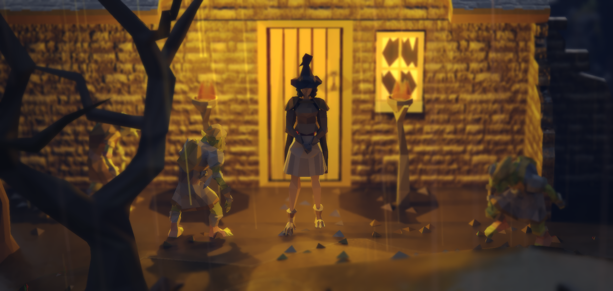
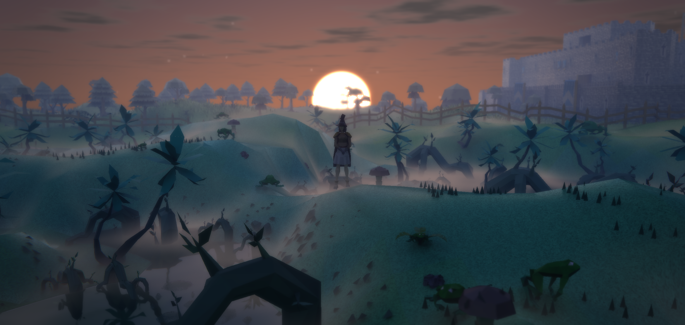
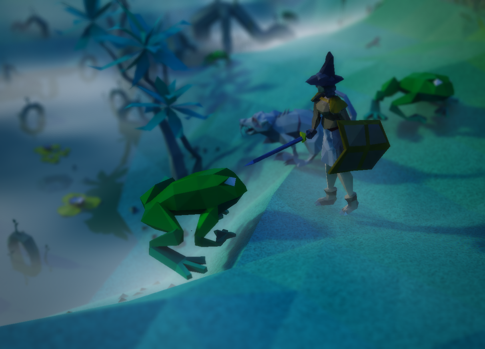
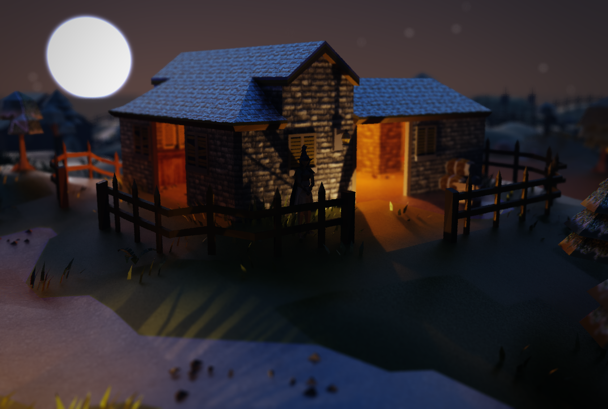
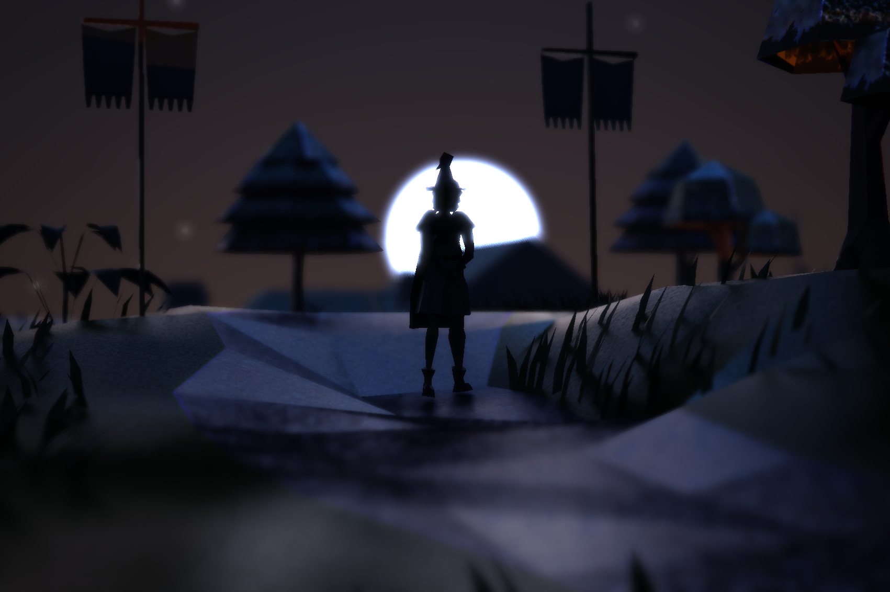
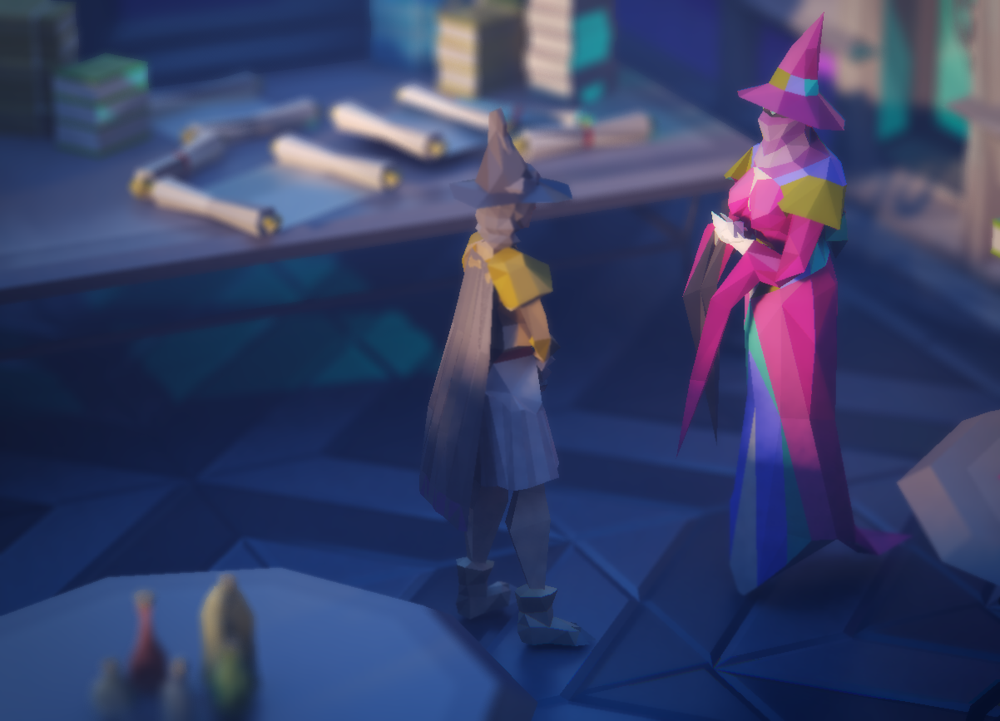

# RLTX

A RuneLite plugin that replaces the GPU renderer with a Vulkan ray tracer. Pure triangles with
ray traced lighting: a sky computed from sunlight scattering in the air, following real time and
place, with the real stars and the moon in its true place and phase, aurora at high latitudes and
rainbows after rain; local lights with shadows, including those of spells and projectiles; path
traced bounce light; water with refraction and reflection that the camera can dip beneath;
weather with volumetric clouds, mist, smoke, heat shimmer and light shafts; seasons from the
date that turn and drop the leaves; birds, bats, butterflies, fireflies and dust in the air;
footprints in snow and wet ground; and a lens flare. A photo mode accumulates each photo over
hundreds of frames through a real thin lens, so it carries no noise and true bokeh, with click
to focus, focus peaking and a linear HDR file beside each shot, and a cinema mode renders
keyframed camera paths the same way for video, carrying the clock with them. Routes from
Shortest Path and tiles from Ground Markers are drawn as light on the ground, and NPCs
highlighted by other plugins wear a rim of their colour. Every one of these has its own toggle.
The Vulkan output is composited through the client's OpenGL canvas, so RuneLite's own interface
is untouched.

## Screenshots

## Requirements

- Linux or Windows. Linux is where RLTX is developed and played. The Windows path runs the same
  renderer, with NT handles in place of file descriptors for the Vulkan to OpenGL handoff; it
  compiles but has not yet been run on a Windows machine. There is no macOS path, as Apple's
  drivers have no Vulkan ray queries.
- A GPU and driver with Vulkan 1.2 ray queries (`VK_KHR_ray_query`) and external memory and
  semaphore file descriptors. Developed on an NVIDIA RTX 4070 Ti.
- A JDK, 17 or newer, to build. The launch scripts run the client on the Java that ran the
  build; the Windows launcher route runs it on RuneLite's bundled Java.
- `glslangValidator` on the path to compile the shaders: package `glslang-tools` on Debian and
  Ubuntu, `glslang` on Arch and Fedora, and part of the Vulkan SDK from LunarG on Windows.
- RuneLite installed through the Jagex Launcher, to play with a Jagex account.

## Building

    ./gradlew build

Compiles the plugin and the shaders and runs the tests. Gradle fetches RuneLite and LWJGL from
RuneLite's repository and Maven Central on the first run.

## Installing

RuneLite switches developer mode off whenever a launcher starts it, and with it goes plugin
sideloading. RLTX is not on the Plugin Hub, so the way to play with a Jagex account is to have
the Jagex Launcher start a client of our own with the plugin built in. On either system the
first step is the same:

    ./gradlew launchScript

This compiles everything and writes a launch script into `build` with this machine's classpath,
`rltx-client.sh` on Linux and `rltx-client.cmd` on Windows, along with `rltx-classpath.txt` for
the installers below. Everything points at the build output, so after any code change rerunning
this one command and restarting the client is all that is needed.

Once the client is up, turn off the GPU plugin and 117 HD, or any other renderer plugin, since
only one can own the canvas, and turn on RLTX. Console output of the launcher-started client
goes to `~/.runelite/logs/rltx-console.log`: the launcher never reads the pipe it hands the
client, and a full pipe would freeze the game. If Vulkan setup fails, RLTX disables itself and
the reason is in that log.

### Linux

The launcher runs `~/.local/share/Jagex Launcher/games/runelite/RuneLite.AppImage` with the
login session in its environment. The installer keeps that file and puts a small wrapper in its
place that runs our client instead.

1. Install RuneLite from the Jagex Launcher if you have not already, and start it once.
2. Install the wrapper:

       tools/install-jagex-wrapper.sh

   The original AppImage is kept beside it as `RuneLite.AppImage.stock`.
3. Press Play in the Jagex Launcher. The client that opens is RuneLite in developer mode with
   RLTX in its plugin list.

To play the stock client without uninstalling, create the file `~/.runelite/rltx-use-stock`
and delete it to come back; the wrapper also falls back to the stock client whenever the launch
script is missing. To uninstall, delete `RuneLite.AppImage` in the folder above and rename
`RuneLite.AppImage.stock` back to `RuneLite.AppImage`.

### Windows

This route is written from how the pieces are documented to behave and compiles, but nobody has
run it yet. Reports of what happens are welcome.

The launcher runs `RuneLite.exe` from the RuneLite install folder, `%LOCALAPPDATA%\RuneLite` by
default, with the login session in its environment. That executable is a small native stub that
reads `config.json` beside it for the class path, main class and JVM options to start on its
bundled Java, so pointing that file at our client is all the wrapping needed. The stub and the
launcher stay as they are.

1. Install RuneLite from the Jagex Launcher if you have not already, and start it once.
2. In PowerShell, from the repository folder:

       .\gradlew.bat launchScript
       .\tools\install-jagex-launcher.ps1

   The script finds the RuneLite folder through the installer's registry entry, or takes it as
   `-RuneLiteDir`, and keeps the original as `config.json.stock`. If PowerShell refuses to run
   scripts, start it as `powershell -ExecutionPolicy Bypass -File .\tools\install-jagex-launcher.ps1`.
3. Press Play in the Jagex Launcher.

To uninstall, copy `config.json.stock` back over `config.json`. Reinstalling RuneLite rewrites
`config.json` as well, after which the install script needs running again.

### Skyboxes

The Skybox setting lists the skies of the Fantasy Skybox pack by Render Knight and needs its
`Materials` folder in the Skybox pack folder setting. Without the pack, leave Skybox on None and
the procedural sky is used. No skybox images are distributed here.

## Running from Gradle

    ./gradlew run

starts the developer-mode client directly, without the launcher, which works for a legacy
account login or for checking that the renderer comes up; so does running the launch script
from `build` by hand. Add `-PruneliteHome=/some/dir` to use a separate RuneLite home so your
real profile is untouched. A fresh home has the GPU plugin on by default; turn it off in that
client before enabling RLTX. On Windows the Gradle command is `gradlew.bat`.

## Sideloadable jar

    ./gradlew shadowJar

builds `build/libs/rltx-0.1.0-SNAPSHOT-all.jar`, the plugin with the LWJGL Vulkan bindings
included, for `~/.runelite/sideloaded-plugins/` in a client started in developer mode. LWJGL's
core is left out because RuneLite ships its own copy. The launcher-started client never loads
sideloaded plugins, which is why the wrapper above exists.

## Third-party components and notices

RLTX itself is released under the BSD 2-Clause License; see `LICENSE`.

**117 HD** (https://github.com/117HD/RLHD), BSD 2-Clause, copyright (c) 2021, 117. Its licence is
bundled as `src/main/resources/rltx/hd/LICENSE-117HD.txt`. The plugin uses, in original or
adapted form:

- `lights.json` and `materials.json`, bundled unchanged, and `light_ids.json`, a table of the
  object and NPC ids those files name, extracted from 117 HD's game value list.
- Its water type table, from which `WaterType.java` is generated; its water shading, terrain
  and model shading reversal, light placement, flicker and pulse, and point light falloff,
  which are ported into the shaders and Java here.
- Six ground textures from its texture pack, in `src/main/resources/rltx/hd/ground/`, with the
  pack's own provenance notes bundled beside them as `LICENSES.txt`:
  - `gravel.jpg`, `gravel_n.png`: 3dtextures.me, CC0.
  - `snow_1.jpg`, `snow_1_n.png`: AmbientCG, CC0.
  - `sand_1.jpg`, `sand_1_n.png`: derived from a photograph by Romain Dancre on Unsplash, under
    the Unsplash licence.
  - `rock_1.jpg`, `rock_1_n.png`: 117 HD's own, BSD 2-Clause.
  - `grass_1.jpg`, `dirt_1.jpg`, `dirt_1_n.png`: not itemised in the pack's notes; distributed
    by 117 HD under its BSD 2-Clause licence as textures of the project.

  None of the textures 117 HD marks as derivative of Jagex's intellectual property are included.

**LWJGL** (https://www.lwjgl.org), BSD 3-Clause, bundled in the shadow jar; its licence is in
`src/main/resources/rltx/LICENSE-LWJGL.txt`.

**RuneLite** (https://runelite.net), BSD 2-Clause. The plugin builds against the RuneLite client
and its `rlawt` OpenGL context and does not redistribute them.

**Yale Bright Star Catalogue**, 5th revised edition (Hoffleit and Warren 1991), obtained from the
CDS VizieR archive as catalogue V/50. The positions, magnitudes and colours of its 9,096 stars
are repacked into `src/main/resources/rltx/stars.bin` and drawn as the real night sky.

**Open-Meteo** (https://open-meteo.com), weather data under CC BY 4.0. In the real-weather mode
the plugin fetches current conditions from Open-Meteo. Weather data by Open-Meteo.com.

**ipapi.co** (https://ipapi.co) supplies the machine's approximate location in the real time and
place sun mode, under its free tier terms; no data is sent beyond the request itself.

**Old School RuneScape** assets, the models, textures, terrain and object definitions the plugin
renders, are read from the running game client at runtime and are not distributed with this
project. The bundled 117 HD data describes game objects by id and name. Jagex Ltd. owns
RuneScape and its content; this is a fan project under the Jagex Fan Content Policy.

The skyboxes the plugin can load are the user's own files, chosen by directory; none are
distributed here.

### Licence of this project

RLTX is licensed under the BSD 2-Clause License, the same terms as the 117 HD code and data it
incorporates; the full text is in `LICENSE`.
