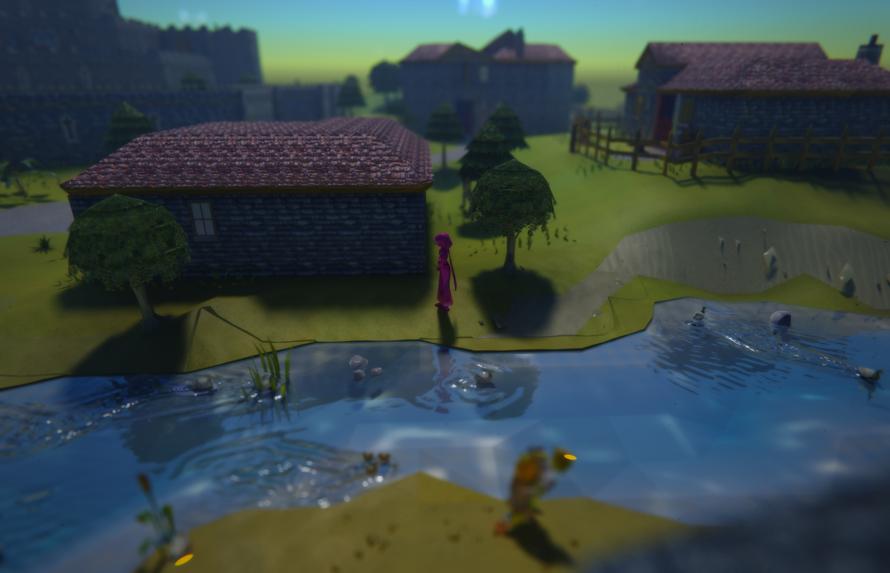
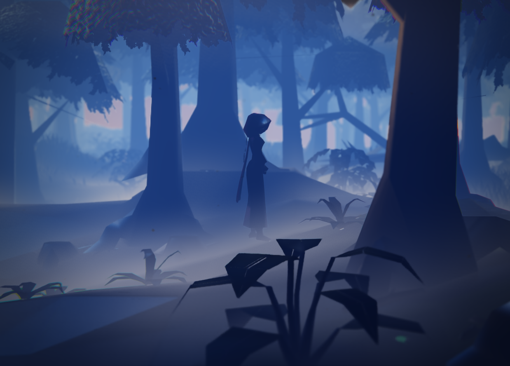

# RLTX

Old School RuneScape with raytracing

## What it does

Everything below has its own setting.

**Light**
- Ray traced sun and moon shadows
- Local lights from 117 HD's light data including
    - spells and projectiles
    - path traced bounce light
    - glossy and wet reflections

**Sky**
- Fully procedural sky computed from sunlight scattering in the atmosphere
- Follows the clock and your location
- Volumetric clouds
- Aurora at high latitudes
- Rainbows after rain
- Lens flare

**Weather and seasons**
- Real weather for your location
  - Cloud
  - Fog
  - Rain
  - Snow
  - Storms
  - Wind
- Wet ground
- Puddles
- Runoff
- Mist over swamps and graveyards
- Smoke from chimneys and fires with heat shimmer above them
- Seasons from the date turn and drop the leaves, bare the trees in winter, and blossom in spring

**Water**
- Wind-driven wave spectrum with refraction, reflection, caustics and rain ripples
- Free camera can go beneath the surface

**Life**
- Fireflies, dust in sunbeams, birds, bats and butterflies
- Footprints in snow and wet ground
- Ripples from steps in puddles
- Plants pushed aside by whoever walks through them

**Photography**
- A photo mode that hides the interface
- Temporal accumulation
- Clean images with true bokeh
- Click to focus
- Focus peaking
- Linear HDR file beside each shot
- Quad-resolution photo key
- Bloom
- Vignette
- Grain
- Chromatic aberration
- Colour grading
- Depth of field

**Other plugins**
- Shortest Path's route is integrated into the environment
- Ground Markers' tiles become pools of light
- NPCs highlighted by NPC Indicators, Slayer and others wear a rim of their colour

**Nothing here reads or changes gameplay. RLTX draws only what the client already has. All game interactions are unchanged.**

## Requirements
**Hardware:**
- Developed on an NVIDIA RTX 4070 Ti, would not recommend anything less
- (Optional) RTX for DLSS

**OS:**
- Linux: yes
- Windows: probably, untested
- TempleOS: no
- FreeBSD: no
- macOS: no

**Software:**
- GPU driver with Vulkan 1.2 ray queries and external memory sharing
- A JDK, 17 or newer, and `glslangValidator` on the path (`glslang-tools` on Debian and Ubuntu, `glslang` on Arch and Fedora, the Vulkan SDK on Windows).
- RuneLite installed through the Jagex Launcher, to play with a Jagex account.
- (Optional) For DLSS: `gcc` and `git`. The launch script fetches NVIDIA's DLSS SDK
  from GitHub and compiles a small bridge to it; without them the DLSS setting says so in the log and does nothing.

## Building

    ./gradlew build

Compiles the plugin and shaders and runs the tests.

## Installing

RuneLite disables plugin sideloading whenever a launcher starts it, and RLTX is not on the Plugin
Hub, so the Jagex Launcher is made to start a client of our own with the plugin built in.

First, on either system:

    ./gradlew launchScript

This writes a launch script into `build` with this machine's classpath: `rltx-client.sh` on
Linux, `rltx-client.cmd` on Windows. Rerun it after any code change.

**Linux.** The launcher runs `~/.local/share/Jagex Launcher/games/runelite/RuneLite.AppImage`.
Install RuneLite from the launcher and start it once, then run `tools/install-jagex-wrapper.sh`.
It keeps the AppImage as `RuneLite.AppImage.stock` and puts a wrapper in its place that starts
our client. Press Play. To use the stock client without uninstalling, create the file
`~/.runelite/rltx-use-stock`; to uninstall, rename the stock AppImage back.

**Windows.** The launcher runs `RuneLite.exe`, a stub that reads `config.json` beside it for the
class path and main class to start. Install RuneLite from the launcher and start it once, then in
PowerShell run `.\gradlew.bat launchScript` and `.\tools\install-jagex-launcher.ps1`. It keeps
the original as `config.json.stock`. Press Play. To uninstall, copy the stock file back.
Reinstalling RuneLite also rewrites `config.json`, after which the script needs running again.

In the client, turn off the GPU plugin and 117 HD, then turn on RLTX. Console output goes to
`~/.runelite/logs/rltx-console.log`, because the launcher never reads the pipe it gives the
client. If Vulkan setup fails, RLTX turns itself off and the reason is in that log.

`./gradlew run` starts the developer-mode client without the launcher, for a legacy account or a
quick check; `-PruneliteHome=/some/dir` keeps it away from your real profile. `./gradlew
shadowJar` builds a sideloadable jar for clients started in developer mode.

## Settings

- Most Settings live in RuneLite's sidebar under RLTX
- Open the floating panel with F8 to see all settings
- `docs/settings.md` lists every setting with its default

## Licence and notices

RLTX is released under the BSD 2-Clause License; see `LICENSE`.

- **117 HD** (https://github.com/117HD/RLHD), BSD 2-Clause, copyright (c) 2021, 117; licence
  bundled as `src/main/resources/rltx/hd/LICENSE-117HD.txt`. Used: `lights.json` and
  `materials.json` unchanged, a table of the ids they name, its water type table, and its water
  shading, shading reversal, light placement, flicker and falloff, ported into the shaders and
  Java here. Six ground textures from its pack are in `src/main/resources/rltx/hd/ground/` with
  the pack's provenance notes beside them: gravel (3dtextures.me, CC0), snow (AmbientCG, CC0),
  sand (from a photograph by Romain Dancre, Unsplash licence), rock (117 HD, BSD 2-Clause),
  grass and dirt (117 HD, BSD 2-Clause). None of the textures 117 HD marks as derived from
  Jagex's property are included.
- **LWJGL** (https://www.lwjgl.org), BSD 3-Clause, bundled in the shadow jar; licence in
  `src/main/resources/rltx/LICENSE-LWJGL.txt`.
- **RuneLite** (https://runelite.net), BSD 2-Clause; built against, not redistributed.
- **Yale Bright Star Catalogue**, 5th revised edition (Hoffleit and Warren 1991), from the CDS
  VizieR archive as V/50; its 9,096 stars are repacked into `src/main/resources/rltx/stars.bin`.
- **Open-Meteo** (https://open-meteo.com), weather data under CC BY 4.0, fetched in the
  real-weather mode. **ipapi.co** (https://ipapi.co) supplies an approximate location in the
  real time and place mode.
- **Old School RuneScape** models, textures and terrain are read from the running client and are
  not distributed. Jagex Ltd. owns RuneScape and its content; this is a fan project under the
  Jagex Fan Content Policy.
